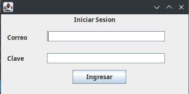
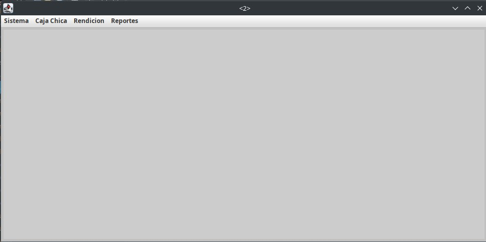
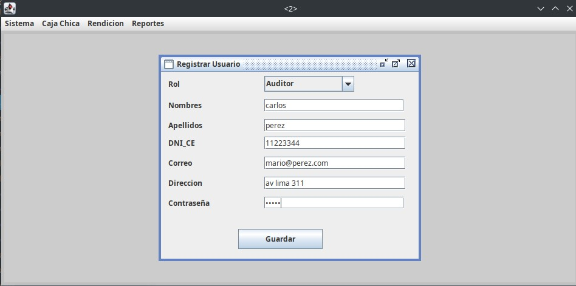
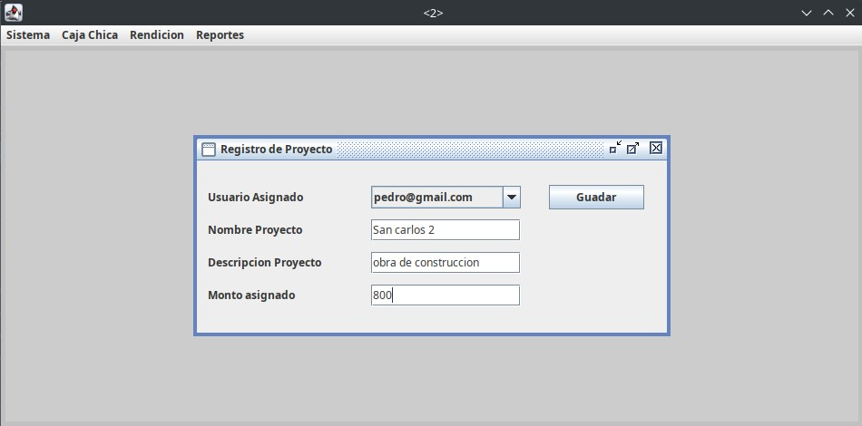
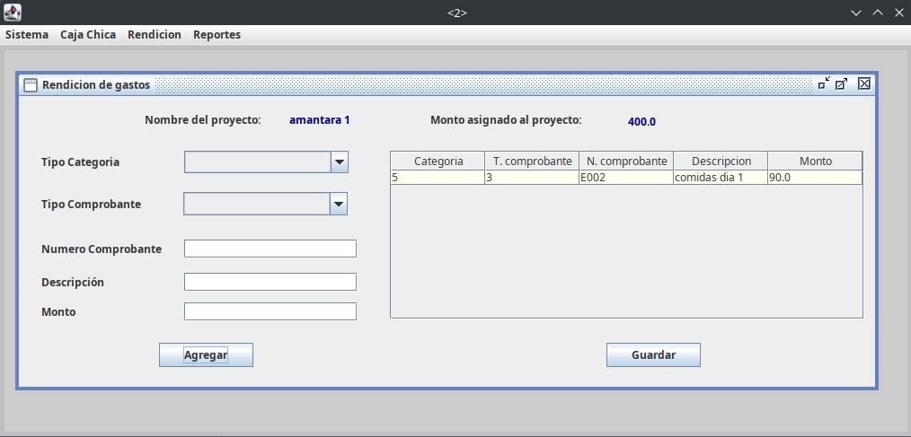
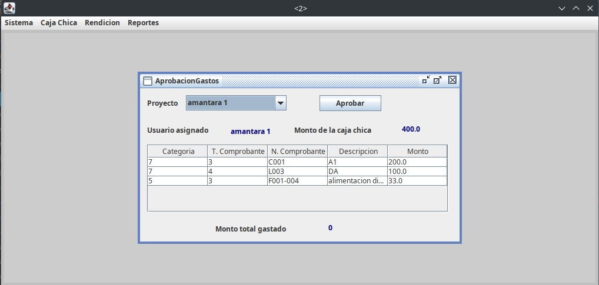

### Caja Chica Swing

Aplicacion swing que permite registrar caja chicas para proyectos y registrar gastos finales


Herramientas utilizadas:

- [SQlite](#)
- [Eclipse 2024-09](#)
- [DB Broswser](#)
- [Java 17](#)

### Estructura del proyecto

```
|- lib/                                  // Jar de SQlite
|- bd/                                   // directorio con la base de datos
|- src/
|   |
|   |- controller/                       // Directorio con la conexión  a las acciones del modelo
|   |- model/                            // Directorio con la conexión y codigo con las Queries hacia la BD
|   |- view/                             // Directorio con todas las pantallas utilizadas
```

---

**Nota:** Para ejecutar el proyecto hay que lanzar el archivo  `.../cajachica2/src/view/InicioSesion.java`

---

### Modelo de la Base de datos

[diagrama BD](images/caja_chica_diagrama.png)

#### Imagenes

|x|x|x|
|---|---|---|
||| |
||| |